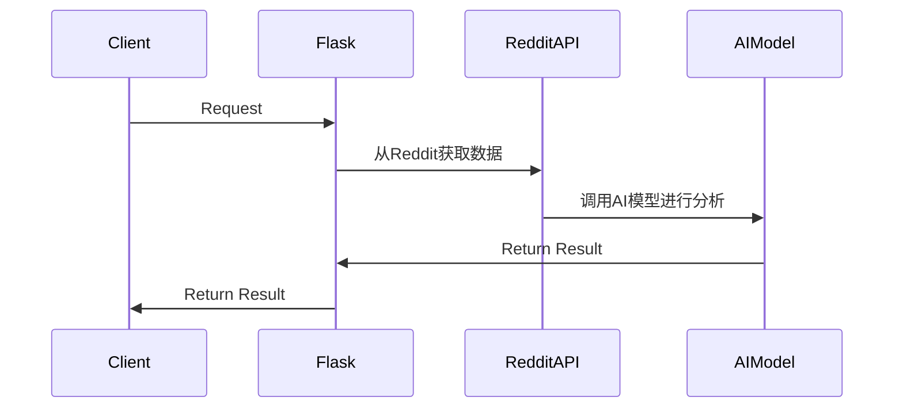
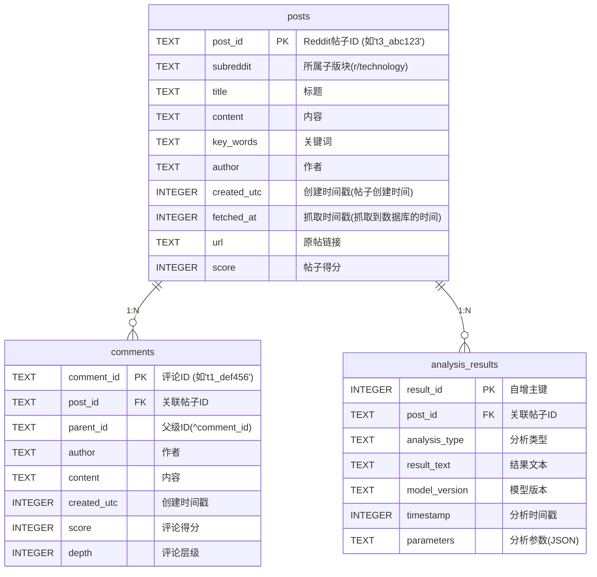

## 后端项目

### 架构

首先，这个项目是一个前后端分离的项目，前端使用React NextJS。后端使用 Python Flask，前端和后端之间通过 `RESTful`
API（TODO）进行通信。

1. 设计OpenAI服务模块与Reddit数据分析功能
2. 制定完整的测试策略，覆盖所有API端点和服务
3. 考虑错误处理、安全性和性能优化
4. 定时任务每小时运行，使用APScheduler库，自动从Reddit获取新帖子和评论，进行AI分析。
5.

后端的任务是:

1. 任务可使⽤任意AI模型例如 OpenAI API 或 DeepSeek API 进⾏⽂本分析和总结。
   > 可以为用户提供设置页面来控制AI模型的选择。
2. 任务执⾏后，需返回**结构化**的结果，供⽤⼾查看。
   > 结构化的结果是指，返回的数据是一个JSON对象，包含了Reddit的数据和AI模型的分析结果。
3. 获取Reddit的数据，然后调用AI模型进行分析，最后返回结果给前端。
4. 定时任务
    - 每隔⼀段时间（如 1 ⼩时）⾃动运⾏⼀次任务，获取最新信息并进⾏ AI 分析。
    - ⽤⼾可在前端调整任务参数（如关键词、分析⽅法等）。



TODO: 任务调度，没有定时任务的实现。

### 数据库设计

我的想法是：
> 利用定时任务每小时从Reddit获取数据，保存到SQLite数据库，然后在AI对话时从数据库中分析数据。
> 这种方法可以减少对Reddit API的频繁调用，提升效率。

#### 实现细节

1. 定时任务：使用APScheduler库，(如)每小时运行一次任务，从Reddit获取新帖子和评论，存储到数据库。
2. 数据库设计：SQLite包括posts、comments和analysis_results表，通过索引支持时间范围查询。
3. AI分析：对话时从数据库中检索相关数据，使用OpenAI或DeepSeek API进行分析，返回结构化结果。

#### 数据库内容



### API接口设计

先来明确前端需要什么：

1. 一个可以对话式的表单
2. 需要将选项（api-key）传递给后端

API包括聊天设置、模型列表、聊天发送（普通和流式）及Reddit数据查询，详细规范了请求和响应格式，方便前端集成。

后端的API接口设计如下：

#### OpenAI API

`POST: /api/chat/send` - 发送聊天消息并获取 AI回复

请求 response:

| 参数      | 类型     | 描述      |
|---------|--------|---------|
| message | string | 用户发送的消息 |

响应 response:

| 参数      | 类型     | 描述      |
|---------|--------|---------|
| success | bool   | 是否成功    |
| message | string | AI回复的消息 |
| error   | string | 错误信息    |

`POST: /api/chat/stream` - 以流式方式获取 AI 回复

请求 response:

| 参数       | 类型    | 描述          |
|----------|-------|-------------|
| stream   | bool  | 是否以流式方式获取回复 |
| messages | array | 用户发送的消息     |

响应 response:

| 参数      | 类型     | 描述      |
|---------|--------|---------|
| success | bool   | 是否成功    |
| message | string | AI回复的消息 |
| error   | string | 错误信息    |

`POST: /api/chat/settings` - 设置 AI 模型

请求 response:

| 参数      | 类型     | 描述      |
|---------|--------|---------|
| model   | string | AI 模型名称 |
| api_key | string | API key |

响应 response:

| 参数      | 类型     | 描述   |
|---------|--------|------|
| success | bool   | 是否成功 |
| error   | string | 错误信息 |

`GET: /api/chat/models` - 获取支持的 AI 模型列表

响应 response:

| 参数     | 类型     | 描述      |
|--------|--------|---------|
| models | array  | AI 模型列表 |
| error  | string | 错误信息    |

#### Reddit API

`POST | GET: /api/reddit` - 获取 Reddit 数据

请求 response:

| 参数        | 类型     | 描述        |
|-----------|--------|-----------|
| subreddit | string | Reddit 版块 |
| time      | string | 时间范围      |
| keyword   | string | 关键字       |

响应 response:
`TODO: Reddit API的设计`
| 参数 | 类型 | 描述 |
|---------|--------|-------------|
| success | bool | 是否成功 |
| posts | array | Reddit 帖子列表 |
| data | object | Reddit 数据 |
| error | string | 错误信息 |

### AI API使用

利用OpenAI API的SDK，可以很方便地调用OpenAI的API。

```python
client = OpenAI(api_key="api key", base_url="https://api.deepseek.com")

response = client.chat.completions.create(
    model="deepseek-chat",
    messages=[
        {"role": "system", "content": "You are a helpful assistant"},
        {"role": "user", "content": "Hello"},
    ],
    stream=False
)

print(response.choices[0].message.content)
```

### 定时任务实现

打算使用`APScheduler`

每小时运行一次，获取前一小时创建的Reddit帖子和评论。
使用PRAW库与Reddit API交互，获取指定子版块（如technology、science）的最新帖子。
为每个新帖子获取评论，存储到数据库，并使用AI模型（如OpenAI）生成评论摘要，存储分析结果。
