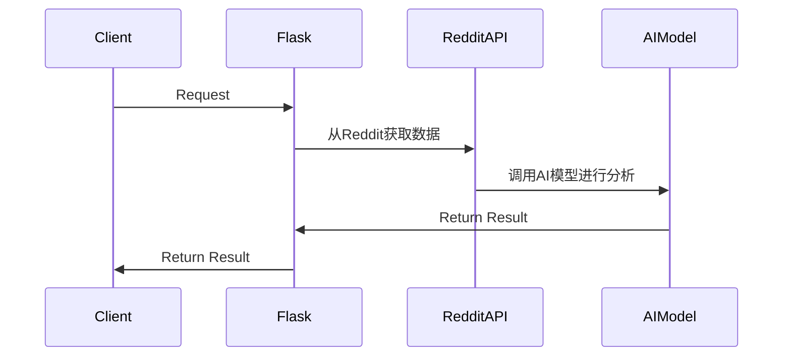

## 后端项目

### 架构

首先，这个项目是一个前后端分离的项目，前端使用React NextJS。后端使用 Python Flask，前端和后端之间通过RESTful
API（TODO）进行通信。其次，后端使用了Spring
Security来实现用户认证和授权。最后，后端使用了Flask来操作。

后端的任务是:

1. 任务可使⽤任意AI模型例如 OpenAI API 或 DeepSeek API 进⾏⽂本分析和总结。
   > 可以为用户提供设置页面来控制AI模型的选择。
2. 任务执⾏后，需返回**结构化**的结果，供⽤⼾查看。
   > 结构化的结果是指，返回的数据是一个JSON对象，包含了Reddit的数据和AI模型的分析结果。
3. 获取Reddit的数据，然后调用AI模型进行分析，最后返回结果给前端。
4. 定时任务
    - 每隔⼀段时间（如 1 ⼩时）⾃动运⾏⼀次任务，获取最新信息并进⾏ AI 分析。
    - ⽤⼾可在前端调整任务参数（如关键词、分析⽅法等）。



TODO: 任务调度，没有定时任务的实现。

### API接口设计

先来明确前端需要什么：

1.一个可以对话式的表单
2.需要将选项（）传递给后端

后端的API接口设计如下：

`POST /api/chat/message` - 发送聊天消息并获取 AI 回复
`POST /api/chat/stream` - 以流式方式获取 AI 回复
`GET /api/chat/models` - 获取支持的 AI 模型列表


### API使用

利用OpenAI API的SDK，可以很方便地调用OpenAI的API。

```python
client = OpenAI(api_key="api key", base_url="https://api.deepseek.com")

response = client.chat.completions.create(
    model="deepseek-chat",
    messages=[
        {"role": "system", "content": "You are a helpful assistant"},
        {"role": "user", "content": "Hello"},
    ],
    stream=False
)

print(response.choices[0].message.content)
```

### 项目开发步骤